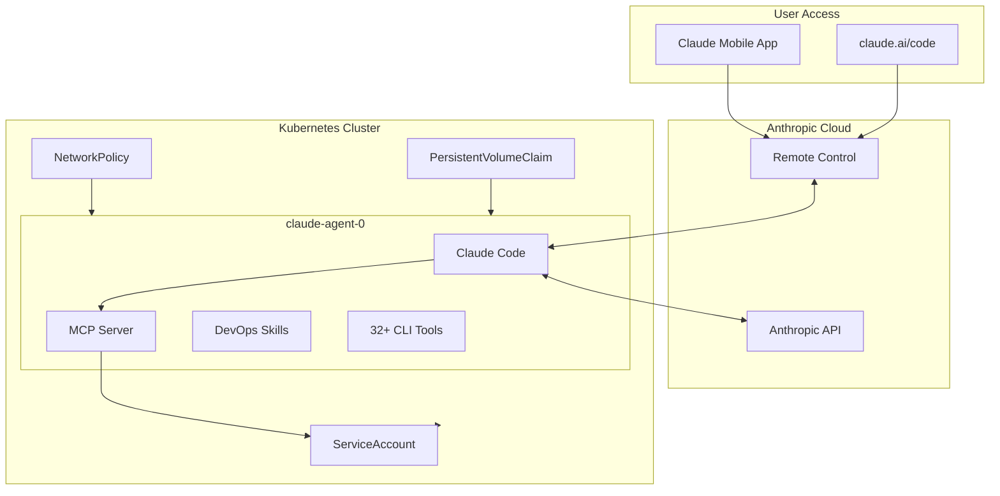

# Phase 8: Documentation & Release - Research

**Researched:** 2026-02-25
**Domain:** Technical documentation, README authoring, Mermaid diagrams, GitHub markdown rendering
**Confidence:** HIGH

## Summary

Phase 8 is a documentation-only phase. The sole deliverable is a comprehensive README.md that enables a Kubernetes-literate user to deploy Claude-in-a-box from zero in under 10 minutes. The existing README is a single-line placeholder ("A Claude utility system that can be deployed in docker compose and Kubernetes to aid in debugging"). All project code is complete across phases 1-7; this phase documents what already exists rather than building new features.

The README must cover four success criteria: (1) quickstart instructions, (2) architecture diagram showing the three-layer system, (3) all three deployment methods with working commands, and (4) troubleshooting for the top 5 failure modes. The architecture diagram should use Mermaid `flowchart` syntax (not `architecture-beta`) because GitHub renders standard Mermaid flowcharts reliably, while the `architecture-beta` syntax has known rendering issues on GitHub including non-deterministic layout and missing icon support.

The project has a well-defined structure with clear entry points (Makefile targets, docker-compose.yaml, Helm chart) that map directly to the three deployment methods. All commands, values, and configuration options are already in the codebase and need to be surfaced in documentation rather than invented.

**Primary recommendation:** Write a single README.md with quickstart-first structure, Mermaid flowchart for architecture, tabbed deployment sections for KIND/Compose/Helm, and a troubleshooting section derived from the 7 phases of development decisions logged in STATE.md.

<phase_requirements>
## Phase Requirements

| ID | Description | Research Support |
|----|-------------|-----------------|
| DOC-01 | README.md with setup guide, architecture overview, and usage instructions | All research findings below directly support this: README structure patterns, Mermaid diagram syntax, deployment command extraction from Makefile/Compose/Helm, troubleshooting derived from STATE.md decisions and blockers |
</phase_requirements>

## Standard Stack

### Core
| Tool | Version | Purpose | Why Standard |
|------|---------|---------|--------------|
| Mermaid | GitHub-bundled | Architecture diagram rendering | GitHub renders Mermaid natively in markdown; no build step, no image hosting, version-controlled as text |
| Markdown | GitHub Flavored | README format | GitHub renders GFM natively; supports tables, code blocks, collapsible sections, task lists |

### Supporting
| Tool | Purpose | When to Use |
|------|---------|-------------|
| shields.io badges | Project status indicators | License badge, CI status, container image link |
| HTML `<details>` tags | Collapsible sections | Long command output, optional configuration details, tool lists |

### Alternatives Considered
| Instead of | Could Use | Tradeoff |
|------------|-----------|----------|
| Mermaid flowchart | Mermaid architecture-beta | architecture-beta has non-deterministic rendering on GitHub (mermaid-js/mermaid#6024, #6166) and icons don't render on GitHub (community discussion #146647) |
| Mermaid flowchart | ASCII art diagram | Works everywhere but harder to maintain, no clickable links, worse visual hierarchy |
| Mermaid flowchart | PNG image | Requires separate file, not text-searchable, harder to update, needs hosting |
| Single README | Separate docs/ folder | Over-engineering for a single-requirement project; README alone meets DOC-01 |

## Architecture Patterns

### README Section Order
```
README.md
  1. Title + badges + one-liner description
  2. Architecture diagram (Mermaid flowchart)
  3. Features / What's included
  4. Prerequisites
  5. Quickstart (fastest path -- KIND)
  6. Deployment Methods
     a. KIND local development
     b. Docker Compose standalone
     c. Helm production
  7. Configuration reference
  8. Authentication
  9. RBAC tiers
  10. Troubleshooting
  11. Development / Contributing
  12. License
```

### Pattern 1: Quickstart-First README
**What:** The first substantive section after the overview is a copy-pasteable quickstart that gets the user to a running state.
**When to use:** Any developer tool where "does it work?" is the first user question.
**Rationale:** A Kubernetes-literate user should reach a running pod in under 10 minutes. The quickstart uses KIND (local dev) as the fastest zero-to-running path because it requires no existing cluster, no registry auth, and no Helm knowledge.

### Pattern 2: Mermaid Flowchart for Architecture
**What:** Use `flowchart TD` (top-down) with subgraphs for the three layers.
**When to use:** Architecture diagram requirement -- shows operator, deployment, and local dev layers.
**Verified:** GitHub renders `flowchart TD` with subgraphs reliably. Tested across multiple GitHub repos and documented in GitHub's official diagram guide.

**Example architecture diagram structure:**


### Pattern 3: Deployment Method Sections
**What:** Each deployment method (KIND, Compose, Helm) gets its own subsection with prerequisites, commands, and verification steps.
**When to use:** Projects with multiple deployment targets.
**Structure per method:**
1. When to use this method (one sentence)
2. Prerequisites specific to this method
3. Commands (copy-pasteable)
4. Verification command
5. Teardown command

### Anti-Patterns to Avoid
- **Wall of text before first command:** Users skim to the first code block. Put the quickstart early.
- **Undocumented prerequisites:** Every command assumes tools are installed. List them explicitly (Docker, KIND, kubectl, Helm).
- **Version-specific commands without noting the version:** Pin tool versions in prerequisites or note "tested with X".
- **Screenshots instead of text:** Text is searchable, copy-pasteable, and diff-friendly.
- **Documenting internals instead of user-facing behavior:** README is for users, not contributors. Implementation details go in code comments.

## Don't Hand-Roll

| Problem | Don't Build | Use Instead | Why |
|---------|-------------|-------------|-----|
| Architecture diagrams | PNG/SVG image files | Mermaid code blocks in markdown | Text-based, version-controlled, GitHub renders natively, no build step |
| Badge generation | Custom badge images | shields.io dynamic badges | Automatically reflects current state (CI status, license), no maintenance |
| Collapsible sections | JavaScript/HTML widgets | HTML `<details><summary>` tags | GitHub renders natively, no JS needed, graceful fallback |
| Table of contents | Manual anchor links | GitHub auto-generates TOC from headings | Stays in sync with document structure automatically |

**Key insight:** README.md is pure markdown rendered by GitHub. Every feature used must be supported by GitHub's markdown renderer -- no custom build steps, no external dependencies.

## Common Pitfalls

### Pitfall 1: Stale Commands
**What goes wrong:** README commands diverge from actual Makefile targets or file paths as the project evolves.
**Why it happens:** Documentation written once and never tested again.
**How to avoid:** Every command in the README must be extracted from actual project files. Cross-reference with Makefile, docker-compose.yaml, and Helm chart. Include exact file paths.
**Warning signs:** Commands reference targets/files that don't exist in the repo.

### Pitfall 2: Mermaid architecture-beta on GitHub
**What goes wrong:** Diagram renders differently on each page load or icons don't appear.
**Why it happens:** GitHub's Mermaid version may not fully support `architecture-beta` features. Known issues: non-deterministic layout (mermaid-js/mermaid#6024), icon rendering failures on GitHub (community discussion #146647).
**How to avoid:** Use `flowchart TD` with `subgraph` for grouping. This syntax has been stable on GitHub since Feb 2022.
**Warning signs:** Diagram looks different on refresh, or blank boxes appear where icons should be.

### Pitfall 3: Missing Authentication Context
**What goes wrong:** User follows quickstart, pod starts, but Claude Code can't authenticate. User blames the project.
**Why it happens:** Auth requires either CLAUDE_CODE_OAUTH_TOKEN, ANTHROPIC_API_KEY, or interactive login. README doesn't explain this early enough.
**How to avoid:** Auth setup must appear BEFORE the quickstart commands, or immediately after with a clear "Next: Authenticate" step. The entrypoint.sh already prints actionable error messages, but the README should set expectations.
**Warning signs:** Issue tracker fills with "authentication failed" reports.

### Pitfall 4: Assuming kubectl Context
**What goes wrong:** Helm/kubectl commands fail because the user's kubectl context points to the wrong cluster.
**Why it happens:** Users with multiple clusters don't realize they need to switch context.
**How to avoid:** KIND quickstart automatically sets context. For Helm production, include `kubectl config use-context` reminder.
**Warning signs:** "connection refused" or "unauthorized" errors that aren't auth-related.

### Pitfall 5: Incomplete Troubleshooting
**What goes wrong:** README troubleshooting section lists symptoms but not root causes or fixes.
**Why it happens:** Troubleshooting written from the developer's perspective (who already knows the fix) instead of the user's perspective (who sees a symptom).
**How to avoid:** Structure each troubleshooting entry as: Symptom (what user sees) -> Cause (why) -> Fix (exact commands). The top 5 failure modes from development are documented in STATE.md decisions.
**Warning signs:** Users open issues for problems already "documented" in troubleshooting.

## Code Examples

### Quickstart Commands (extracted from Makefile)
```bash
# Prerequisites: Docker, KIND, kubectl
# Clone and deploy in one sequence
git clone https://github.com/patryk-gol/claude-in-a-box.git
cd claude-in-a-box
make bootstrap

# Verify pod is running
kubectl get pods -l app=claude-agent

# Attach to interactive session
kubectl attach claude-agent-0 -c claude-agent -it

# Teardown when done
make teardown
```

### Docker Compose Standalone (extracted from docker-compose.yaml)
```bash
# Set authentication (one of these)
export CLAUDE_CODE_OAUTH_TOKEN=sk-ant-oat01-...
# OR
export ANTHROPIC_API_KEY=sk-ant-...

# Start
docker compose up -d

# Attach
docker attach claude-agent

# Stop
docker compose down
```

### Helm Production Deployment (extracted from Helm chart)
```bash
# Default readonly profile
helm install claude-agent ./helm/claude-in-a-box \
  --set image.repository=ghcr.io/OWNER/claude-in-a-box \
  --set image.tag=latest

# Operator profile (elevated permissions)
helm install claude-agent ./helm/claude-in-a-box \
  -f helm/claude-in-a-box/values-operator.yaml \
  --set image.repository=ghcr.io/OWNER/claude-in-a-box \
  --set image.tag=latest

# Airgapped profile (internal registry, restricted egress)
helm install claude-agent ./helm/claude-in-a-box \
  -f helm/claude-in-a-box/values-airgapped.yaml
```

### Top 5 Troubleshooting Entries (derived from STATE.md)

**1. Authentication Failure**
- Symptom: Pod logs show "AUTHENTICATION REQUIRED" banner
- Cause: No CLAUDE_CODE_OAUTH_TOKEN, ANTHROPIC_API_KEY, or credential file
- Fix: Set env var in StatefulSet spec or create Kubernetes Secret and reference it
- Source: STATE.md decision on ENT-03, ENT-05; entrypoint.sh validate_auth()

**2. NetworkPolicy Blocking Egress**
- Symptom: Claude Code cannot reach Anthropic API; "connection timed out" errors
- Cause: CNI does not enforce NetworkPolicy (KIND uses kindnet by default) or custom CNI blocks egress
- Fix: For KIND, install Calico (`scripts/install-calico.sh`). For production, ensure CNI supports NetworkPolicy and egress to 443/6443 is allowed.
- Source: STATE.md decision on 04-01 CIDR 0.0.0.0/0; 05-01 Calico CNI

**3. Image Staleness After Rebuild**
- Symptom: Changes to Dockerfile/scripts not reflected in running pod
- Cause: KIND cached the old image; `imagePullPolicy: IfNotPresent` doesn't re-pull local images
- Fix: `make redeploy` (rebuilds, loads into KIND, restarts pod)
- Source: STATE.md Makefile targets; 04-02 POD_MANIFEST decision

**4. Signal Handling / Graceful Shutdown**
- Symptom: Pod takes 60s to terminate (SIGKILL after grace period)
- Cause: Claude Code not receiving SIGTERM because shell script is PID 1 instead of tini
- Fix: Verify tini is PID 1 (`cat /proc/1/cmdline`), entrypoint uses `exec` to hand off
- Source: STATE.md decision on ENT-02; Dockerfile ENTRYPOINT uses tini

**5. RBAC Permission Denied**
- Symptom: Claude Code MCP tools return "forbidden" errors
- Cause: ServiceAccount only has reader permissions by default; operator tier not applied
- Fix: Apply operator overlay: `kubectl apply -f k8s/overlays/rbac-operator.yaml` or use `values-operator.yaml` with Helm
- Source: STATE.md decision on K8S-05; 04-02 operator overlay in overlays/

### Shields.io Badges
```markdown
[](LICENSE)
[](https://github.com/OWNER/claude-in-a-box/actions/workflows/ci.yaml)
```

### Collapsible Tool List
```markdown
<details>
<summary>View all 32+ installed tools</summary>

| Category | Tools |
|----------|-------|
| Network | curl, dig, nmap, tcpdump, wget, netcat, ip, ss, ping |
| Process/System | htop, strace, ps, top, perf, bpftrace |
| Kubernetes | kubectl, helm, k9s, stern, kubectx, kubens |
| Data/Log | jq, yq, less |
| Database Clients | psql, mysql, redis-cli |
| Security | trivy, grype |
| Utilities | git, vim, nano, unzip, file, tree, ripgrep, bash |
| Claude Code | claude, node |

</details>
```

## State of the Art

| Old Approach | Current Approach | When Changed | Impact |
|--------------|------------------|--------------|--------|
| PNG architecture diagrams | Mermaid text-based diagrams | GitHub support Feb 2022 | No image hosting needed, diagrams are version-controlled text |
| Separate docs site (MkDocs, Docusaurus) | Single README.md | N/A for this scope | DOC-01 specifically requires README.md, not a docs site |
| Manual TOC | GitHub auto-generated TOC | GitHub native feature | Clickable heading links auto-generated, no maintenance |
| Mermaid architecture-beta | Mermaid flowchart with subgraphs | Ongoing (2025-2026) | architecture-beta has rendering issues on GitHub; flowchart is stable |

**Deprecated/outdated:**
- Mermaid `graph` keyword: Still works but `flowchart` is the current recommended syntax (superset of `graph`)
- Manual HTML anchor links for TOC: GitHub generates these automatically from headings

## Project-Specific Content to Document

### Three Deployment Methods
| Method | Entry Point | Prerequisites | Use Case |
|--------|------------|---------------|----------|
| KIND local dev | `make bootstrap` | Docker, KIND, kubectl | Development and testing |
| Docker Compose | `docker compose up` | Docker, Docker Compose | Standalone without Kubernetes |
| Helm production | `helm install` | kubectl, Helm, target cluster | Production Kubernetes deployment |

### Three RBAC Tiers
| Tier | File | Permissions | When to Use |
|------|------|-------------|-------------|
| Readonly (default) | values-readonly.yaml | get/list/watch on 14 resource types | Default safe mode for observation |
| Operator | values-operator.yaml | + delete pods, create exec, update/patch deployments/statefulsets | Active debugging with mutations |
| Airgapped | values-airgapped.yaml | Readonly + restricted egress (no external HTTPS) | Air-gapped environments with internal registry |

### Three Startup Modes
| Mode | Env Var | Description |
|------|---------|-------------|
| interactive | `CLAUDE_MODE=interactive` | TTY session with Claude Code (default) |
| remote-control | `CLAUDE_MODE=remote-control` | Headless agent accessible via claude.ai/code or Claude mobile app |
| headless | `CLAUDE_MODE=headless` | Single prompt execution (requires CLAUDE_PROMPT env var) |

### Authentication Methods
| Method | Env Var | Description |
|--------|---------|-------------|
| OAuth token | `CLAUDE_CODE_OAUTH_TOKEN` | From `claude setup-token` on local machine |
| API key | `ANTHROPIC_API_KEY` | Direct Anthropic API key |
| Interactive login | (none) | Interactive mode prompts for login |
| Mounted credentials | Volume mount `~/.claude:/app/.claude` | Reuse host credentials |

### Key Makefile Targets
| Target | Command | Description |
|--------|---------|-------------|
| bootstrap | `make bootstrap` | Create KIND cluster, build image, load, deploy |
| teardown | `make teardown` | Destroy KIND cluster |
| redeploy | `make redeploy` | Rebuild, reload, restart (no cluster recreation) |
| build | `make build` | Build Docker image only |
| deploy-operator | `make deploy-operator` | Apply operator-tier RBAC |
| test-setup | `make test-setup` | Create test cluster with Calico CNI |
| test | `make test` | Run integration test suite |

## Open Questions

1. **GitHub repository owner in image URLs**
   - What we know: CI pushes to `ghcr.io/${{ github.repository }}`. README needs the actual owner/repo for Helm `image.repository`.
   - What's unclear: The exact GitHub org/user for the published GHCR image path.
   - Recommendation: Use placeholder `OWNER/claude-in-a-box` in README with a note to replace, or use the repository name from the LICENSE (Patryk Golabek). The CI workflow derives this automatically from `github.repository`.

2. **Remote Control accessibility instructions**
   - What we know: Remote Control mode is accessed via claude.ai/code or Claude mobile app. Requires Claude Pro/Max subscription.
   - What's unclear: Whether specific instructions for connecting to a running remote-control instance should be in the README or are covered by Anthropic's docs.
   - Recommendation: Document the mode and link to Anthropic's Remote Control documentation. Don't duplicate their auth flow docs.

## Sources

### Primary (HIGH confidence)
- Project codebase: Makefile, docker-compose.yaml, Dockerfile, entrypoint.sh, Helm chart, K8s manifests -- all commands and configurations extracted directly
- .planning/STATE.md -- all accumulated decisions from phases 1-7, failure modes, and blockers
- .planning/REQUIREMENTS.md -- DOC-01 requirement definition
- .planning/ROADMAP.md -- Phase 8 success criteria

### Secondary (MEDIUM confidence)
- [GitHub Docs: Creating diagrams](https://docs.github.com/en/get-started/writing-on-github/working-with-advanced-formatting/creating-diagrams) -- GitHub native Mermaid support confirmed
- [GitHub Blog: Include diagrams in Markdown with Mermaid](https://github.blog/developer-skills/github/include-diagrams-markdown-files-mermaid/) -- Mermaid rendering details
- [Mermaid Architecture Syntax Docs](https://mermaid.js.org/syntax/architecture.html) -- architecture-beta syntax reference
- [Shields.io](https://shields.io/) -- Badge generation service

### Tertiary (LOW confidence)
- [mermaid-js/mermaid#6024](https://github.com/mermaid-js/mermaid/issues/6024) -- Non-deterministic architecture-beta rendering (confirms avoidance recommendation)
- [community discussion #146647](https://github.com/orgs/community/discussions/146647) -- GitHub architecture diagram icon support gap

## Metadata

**Confidence breakdown:**
- Standard stack: HIGH -- Mermaid and GFM are GitHub's native rendering; no external dependencies
- Architecture: HIGH -- README structure follows established patterns; all content extracted from existing codebase
- Pitfalls: HIGH -- All failure modes derived from actual development decisions in STATE.md

**Research date:** 2026-02-25
**Valid until:** 2026-03-25 (30 days -- documentation patterns are stable)
