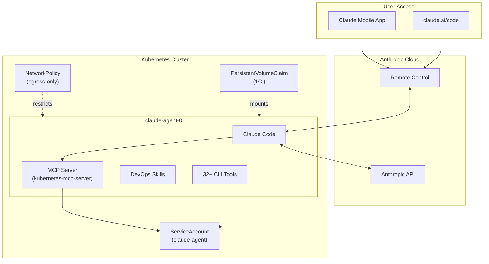

# Claude In A Box

[](LICENSE)
[](https://github.com/PatrykQuantumNomad/claude-in-a-box/actions/workflows/ci.yaml)

Deploy once, control from anywhere -- an AI-powered DevOps agent running inside your Kubernetes cluster, accessible from your phone via Remote Control.

## Architecture



The agent runs as a StatefulSet with a single replica. Claude Code communicates with the Anthropic API over HTTPS (port 443) and queries the Kubernetes API (port 6443) through an in-cluster MCP server. A NetworkPolicy restricts all ingress and limits egress to DNS, HTTPS, and the Kubernetes API. Persistent storage survives pod restarts.

## Features

- **Remote Control access** -- manage your cluster from your phone or claude.ai/code
- **MCP Kubernetes integration** -- in-cluster read-only access to 14 resource types via [kubernetes-mcp-server](https://www.npmjs.com/package/kubernetes-mcp-server)
- **Three startup modes** -- interactive, remote-control, or headless (single prompt execution)
- **Tiered RBAC** -- readonly (default), operator (mutations), or airgapped (restricted egress)
- **NetworkPolicy isolation** -- egress-only policy restricts traffic to DNS, HTTPS, and K8s API
- **PVC persistence** -- conversation history and skills survive pod restarts
- **Non-root execution** -- runs as UID 10000 with tini as PID 1 for proper signal handling
- **Three deployment methods** -- KIND local dev, Docker Compose standalone, or Helm for production

<details>
<summary>View all 32+ installed tools</summary>

| Category | Tools |
|----------|-------|
| Network | curl, dig, nmap, tcpdump, wget, netcat, ip, ss, ping |
| Process/System | htop, strace, ps, top, perf, bpftrace |
| Kubernetes | kubectl, helm, k9s, stern, kubectx, kubens |
| Data/Log | jq, yq, less |
| Database Clients | psql, mysql, redis-cli |
| Security | trivy, grype |
| Utilities | git, vim, nano, unzip, file, tree, ripgrep, bash |
| Claude Code | claude, node |

</details>

## Prerequisites

| Tool | Required For | Install Guide |
|------|-------------|---------------|
| Docker | All methods | [docs.docker.com/get-docker](https://docs.docker.com/get-docker/) |
| KIND | Local dev (quickstart) | [kind.sigs.k8s.io](https://kind.sigs.k8s.io/docs/user/quick-start/#installation) |
| kubectl | KIND and Helm | [kubernetes.io/docs/tasks/tools](https://kubernetes.io/docs/tasks/tools/) |
| Docker Compose v2 | Standalone method | Included with Docker Desktop |
| Helm 3+ | Production method | [helm.sh/docs/intro/install](https://helm.sh/docs/intro/install/) |

**Authentication:** An Anthropic Pro or Max subscription is required for Remote Control mode. An API key (`ANTHROPIC_API_KEY`) or OAuth token (`CLAUDE_CODE_OAUTH_TOKEN`) is required for non-interactive modes. Interactive mode can authenticate on first launch.

## Quickstart (KIND)

The fastest path from zero to a running agent. Requires Docker, KIND, and kubectl.

```bash
git clone https://github.com/PatrykQuantumNomad/claude-in-a-box.git
cd claude-in-a-box
make bootstrap
```

`make bootstrap` creates a KIND cluster, builds the Docker image, loads it into the cluster, applies all Kubernetes manifests (ServiceAccount, RBAC, NetworkPolicy, StatefulSet), and waits for the pod to be Ready.

**Verify the pod is running:**

```bash
kubectl get pods -l app=claude-agent
```

Expected output:

```
NAME              READY   STATUS    RESTARTS   AGE
claude-agent-0    1/1     Running   0          30s
```

**Attach to the interactive session:**

```bash
kubectl attach claude-agent-0 -c claude-agent -it
```

The default startup mode is `interactive`, which prompts for authentication on first launch if no credentials are provided. To pre-configure authentication, see the [Authentication](#authentication) section.

**Teardown:**

```bash
make teardown
```

## Deployment Methods

### KIND Local Development

**When to use:** Local development and testing without an existing Kubernetes cluster.

**Prerequisites:** Docker, KIND, kubectl.

| Command | Description |
|---------|-------------|
| `make bootstrap` | Create KIND cluster, build image, load, and deploy |
| `make redeploy` | Rebuild image, reload into KIND, restart pod (no cluster recreation) |
| `make status` | Show cluster and pod status |
| `make teardown` | Destroy the KIND cluster |

```bash
# Full lifecycle
make bootstrap          # Create cluster + build + deploy
make status             # Check pod status
make redeploy           # After code changes, rebuild and restart
make teardown           # Clean up
```

**Verification:**

```bash
kubectl get pods -l app=claude-agent
kubectl logs claude-agent-0 -c claude-agent
```

### Docker Compose Standalone

**When to use:** Running the agent without Kubernetes. Suitable for single-machine deployments or local testing without KIND.

**Prerequisites:** Docker, Docker Compose v2.

Set at least one authentication method before starting:

```bash
# Option 1: OAuth token (from `claude setup-token` on your local machine)
export CLAUDE_CODE_OAUTH_TOKEN=sk-ant-oat01-...

# Option 2: API key
export ANTHROPIC_API_KEY=sk-ant-...
```

```bash
# Start the agent
docker compose up -d

# Attach to the interactive session
docker attach claude-agent

# Stop the agent
docker compose down
```

The Compose file mounts a named volume (`claude-data`) at `/app/.claude` for persistence. Environment variables `CLAUDE_MODE`, `CLAUDE_CODE_OAUTH_TOKEN`, and `ANTHROPIC_API_KEY` are passed through from the host.

To start in remote-control mode:

```bash
CLAUDE_MODE=remote-control docker compose up -d
```

### Helm Production

**When to use:** Production Kubernetes clusters with an existing cluster and Helm installed.

**Prerequisites:** kubectl (configured for your target cluster), Helm 3+.

**Default readonly profile:**

```bash
helm install claude-agent ./helm/claude-in-a-box \
  --set image.repository=ghcr.io/PatrykQuantumNomad/claude-in-a-box \
  --set image.tag=latest
```

**Operator profile** (elevated permissions for pod delete, exec, rollout restart):

```bash
helm install claude-agent ./helm/claude-in-a-box \
  -f helm/claude-in-a-box/values-operator.yaml \
  --set image.repository=ghcr.io/PatrykQuantumNomad/claude-in-a-box \
  --set image.tag=latest
```

**Airgapped profile** (internal registry, restricted egress -- no external HTTPS):

```bash
helm install claude-agent ./helm/claude-in-a-box \
  -f helm/claude-in-a-box/values-airgapped.yaml
```

The airgapped profile sets `image.repository` to `internal-registry.corp/claude-in-a-box` and disables external HTTPS egress. Update the repository to match your internal registry.

**Security profiles comparison:**

| Profile | File | RBAC | Egress |
|---------|------|------|--------|
| Readonly (default) | `values.yaml` | get/list/watch on 14 resource types | DNS + HTTPS + K8s API |
| Operator | `values-operator.yaml` | + pod delete, pod/exec create, deployment/statefulset update/patch | DNS + HTTPS + K8s API |
| Airgapped | `values-airgapped.yaml` | get/list/watch (readonly) | DNS + K8s API only (no external HTTPS) |

**Set authentication via Helm values:**

```bash
helm install claude-agent ./helm/claude-in-a-box \
  --set claudeMode=remote-control \
  --set image.repository=ghcr.io/PatrykQuantumNomad/claude-in-a-box \
  --set image.tag=latest
```

Pass credentials via a Kubernetes Secret mounted as environment variables, or use `kubectl exec` to authenticate interactively after deployment.

**Verification:**

```bash
kubectl get pods -l app=claude-agent
kubectl logs claude-agent-0 -c claude-agent
```

**Teardown:**

```bash
helm uninstall claude-agent
```

## Configuration Reference

### Environment Variables

| Variable | Default | Description |
|----------|---------|-------------|
| `CLAUDE_MODE` | `interactive` | Startup mode: `interactive`, `remote-control`, or `headless` |
| `CLAUDE_CODE_OAUTH_TOKEN` | (none) | OAuth token from `claude setup-token` |
| `ANTHROPIC_API_KEY` | (none) | Direct Anthropic API key |
| `CLAUDE_PROMPT` | (none) | Prompt for headless mode (required when `CLAUDE_MODE=headless`) |

### Startup Modes

| Mode | Command Executed | Use Case |
|------|-----------------|----------|
| `interactive` | `claude --dangerously-skip-permissions` | TTY session for interactive debugging (default) |
| `remote-control` | `claude remote-control --verbose` | Accessible via [Claude Remote Control](https://docs.anthropic.com/en/docs/claude-code/remote-control) -- control from your phone or claude.ai/code |
| `headless` | `claude -p "$CLAUDE_PROMPT" --output-format json --dangerously-skip-permissions` | Single prompt execution, outputs JSON |

Remote Control mode requires an Anthropic Pro or Max subscription and an OAuth token (`CLAUDE_CODE_OAUTH_TOKEN`). It cannot use an API key.

## Authentication

The entrypoint validates authentication before starting Claude Code. Four methods are supported, checked in this order:

| Priority | Method | Environment Variable / Path | Notes |
|----------|--------|-----------------------------|-------|
| 1 | OAuth token | `CLAUDE_CODE_OAUTH_TOKEN` | Run `claude setup-token` on your local machine to generate |
| 2 | API key | `ANTHROPIC_API_KEY` | Direct API key from [console.anthropic.com](https://console.anthropic.com/) |
| 3 | Mounted credentials | Volume mount `~/.claude:/app/.claude` | Reuse existing credentials from your host machine |
| 4 | Interactive login | (none) | Available in `interactive` mode only -- prompts on first launch |

Non-interactive modes (`remote-control`, `headless`) require method 1, 2, or 3. If no credentials are found, the entrypoint exits with an actionable error message explaining all options.

**Setting credentials in Kubernetes:**

```bash
# Create a secret
kubectl create secret generic claude-auth \
  --from-literal=CLAUDE_CODE_OAUTH_TOKEN=sk-ant-oat01-...

# Reference it in the StatefulSet env (or use Helm --set)
```

## RBAC Tiers

The agent uses a dedicated ServiceAccount (`claude-agent`) with the principle of least privilege. Three RBAC tiers are available.

### Readonly (default)

Applied automatically. Provides `get`, `list`, `watch` on 14 resource types across 4 API groups:

| API Group | Resources |
|-----------|-----------|
| Core (`""`) | pods, services, events, nodes, namespaces, configmaps, persistentvolumeclaims |
| Apps (`apps`) | deployments, statefulsets, daemonsets, replicasets |
| Batch (`batch`) | jobs, cronjobs |
| Networking (`networking.k8s.io`) | ingresses |

No secrets access. No mutation verbs. No aggregation labels.

### Operator

Adds mutation permissions on top of the readonly tier. RBAC is additive -- applying the operator tier does not remove readonly permissions.

| Resource | Additional Verbs |
|----------|-----------------|
| pods | delete (trigger pod restart) |
| pods/exec | create (interactive debugging) |
| deployments, statefulsets | update, patch (rollout restart) |

**Apply via KIND/kubectl:**

```bash
make deploy-operator
# or
kubectl apply -f k8s/overlays/rbac-operator.yaml
```

**Apply via Helm:**

```bash
helm install claude-agent ./helm/claude-in-a-box \
  -f helm/claude-in-a-box/values-operator.yaml
```

**Revoke operator permissions:**

```bash
make undeploy-operator
# or
kubectl delete -f k8s/overlays/rbac-operator.yaml
```

### Airgapped

Uses the readonly RBAC tier with restricted egress. External HTTPS is disabled -- only DNS and Kubernetes API (restricted to `10.96.0.1/32`) are allowed. Requires an internal container registry.

```bash
helm install claude-agent ./helm/claude-in-a-box \
  -f helm/claude-in-a-box/values-airgapped.yaml \
  --set image.repository=your-registry.internal/claude-in-a-box
```

## Troubleshooting

### 1. Authentication Failure

**Symptom:** Pod logs show the `AUTHENTICATION REQUIRED` banner and the container exits.

**Cause:** No `CLAUDE_CODE_OAUTH_TOKEN`, `ANTHROPIC_API_KEY`, or credential file is present, and the mode is not `interactive`.

**Fix:**
```bash
# Check pod logs for the auth error
kubectl logs claude-agent-0 -c claude-agent

# Set credentials via environment variable
kubectl set env statefulset/claude-agent CLAUDE_CODE_OAUTH_TOKEN=sk-ant-oat01-...

# Or switch to interactive mode to log in manually
kubectl set env statefulset/claude-agent CLAUDE_MODE=interactive
kubectl attach claude-agent-0 -c claude-agent -it
```

### 2. NetworkPolicy Blocking Egress

**Symptom:** Claude Code cannot reach the Anthropic API. Logs show "connection timed out" or "connection refused" errors.

**Cause:** The CNI plugin does not enforce NetworkPolicy (KIND's default `kindnet` does not), or a cluster-level policy is blocking egress to port 443 or 6443.

**Fix:**
```bash
# For KIND: install Calico to enforce NetworkPolicy
scripts/install-calico.sh

# For production: verify your CNI supports NetworkPolicy and allows
# egress to TCP 443 (Anthropic API) and TCP 6443 (K8s API)
kubectl get networkpolicy -n default
kubectl describe networkpolicy claude-agent-netpol -n default
```

### 3. Image Staleness After Rebuild

**Symptom:** Changes to Dockerfile or scripts are not reflected in the running pod after rebuilding.

**Cause:** KIND cached the previous image. `imagePullPolicy: IfNotPresent` does not re-pull locally loaded images.

**Fix:**
```bash
# Rebuild, reload into KIND, and restart the pod in one command
make redeploy
```

`make redeploy` rebuilds the Docker image, loads it into the KIND cluster (replacing the cached version), deletes the existing pod, re-applies manifests, and waits for the new pod to be Ready.

### 4. Signal Handling / Graceful Shutdown

**Symptom:** Pod takes the full 60-second termination grace period before being killed (SIGKILL).

**Cause:** Claude Code is not receiving SIGTERM because the shell entrypoint script is PID 1 instead of tini, or the entrypoint is not using `exec` to hand off the process.

**Fix:**
```bash
# Verify tini is PID 1
kubectl exec claude-agent-0 -c claude-agent -- cat /proc/1/cmdline | tr '\0' ' '
# Expected: /usr/local/bin/tini -- /usr/local/bin/entrypoint.sh

# Verify entrypoint uses exec (check that claude is a direct child of tini)
kubectl exec claude-agent-0 -c claude-agent -- ps aux
```

The Dockerfile sets `ENTRYPOINT ["/usr/local/bin/tini", "--"]` and the entrypoint script uses `exec` to replace itself with the Claude Code process, ensuring signals are delivered directly.

### 5. RBAC Permission Denied

**Symptom:** Claude Code or MCP tools return "forbidden" errors when querying Kubernetes resources.

**Cause:** The ServiceAccount only has reader permissions by default. Mutation operations (delete, exec, patch) require the operator tier.

**Fix:**
```bash
# Check current permissions
kubectl auth can-i --as=system:serviceaccount:default:claude-agent --list

# Apply operator tier for mutation permissions
kubectl apply -f k8s/overlays/rbac-operator.yaml

# Or with Helm
helm upgrade claude-agent ./helm/claude-in-a-box \
  -f helm/claude-in-a-box/values-operator.yaml
```

## Development

### Makefile Targets

| Target | Description |
|--------|-------------|
| `make bootstrap` | Create KIND cluster, build image, load, and deploy |
| `make teardown` | Destroy the KIND cluster |
| `make redeploy` | Rebuild image, load into KIND, restart pod |
| `make build` | Build the Docker image |
| `make deploy` | Apply k8s manifests and wait for Ready |
| `make deploy-operator` | Apply operator-tier RBAC |
| `make undeploy-operator` | Remove operator-tier RBAC |
| `make status` | Show cluster and pod status |
| `make test-setup` | Create test cluster with Calico CNI and deploy |
| `make test` | Run integration test suite (BATS) |
| `make test-teardown` | Destroy test cluster |
| `make help` | Show all available targets |

### Integration Tests

The integration test suite uses [BATS](https://github.com/bats-core/bats-core) and requires a KIND cluster with Calico CNI for NetworkPolicy enforcement.

```bash
make test-setup    # Create cluster with Calico, build, and deploy
make test          # Run integration tests
make test-teardown # Destroy test cluster
```

### CI Pipeline

The GitHub Actions CI pipeline (`.github/workflows/ci.yaml`) runs on every push and pull request:

1. **Build and push** -- Docker Buildx multi-stage build, pushes to `ghcr.io/PatrykQuantumNomad/claude-in-a-box`
2. **Trivy vulnerability scan** -- Scans for CRITICAL and HIGH severity CVEs, uploads SARIF to GitHub Security tab
3. **SBOM generation** -- Produces SPDX JSON software bill of materials
4. **Helm lint** -- Strict lint of the Helm chart plus golden file tests

## License

[MIT](LICENSE) -- Copyright (c) 2026 Patryk Golabek
